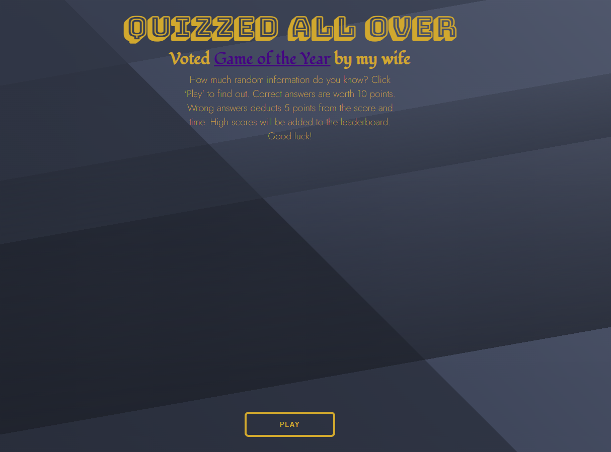

# Quizzed All  Over

## Description

This is a trivia game that was created using mostly JavaScript, with a touch of CSS for styling. It's a pretty standard trivia game. You will be asked a question, given 4 choices, and if you choose correctly you will get 10 points. If you guess incorrectly, the timer will subtract 5 seconds from the game and you will lose 5 points. If you beat the clock and finish the game, you can add your initials to the leaderboard which will be displayed indefinitely. You can play the game [here](https://dsatpm.github.io/quiz_game) 

## Visuals

Snapshot of my completed project

## Installation

There is nothing special needed for installation. It runs in your browser. The responsiveness of the app is not great, so it is best utilized using a full viewport.

## Usage

Test your trivia knowledge! Put your high score on the leaderboard! That's about it.

## Support

For any questions or comments, you can reach me at [Twitter](https://twitter.com/__dsatpm)

## Contributions

This project was created by Jeremiah Haynes, and Junior Solorio helped debug portions of it. 

## Project Status

The projct is complete except for adjusting the responsive design aspects.